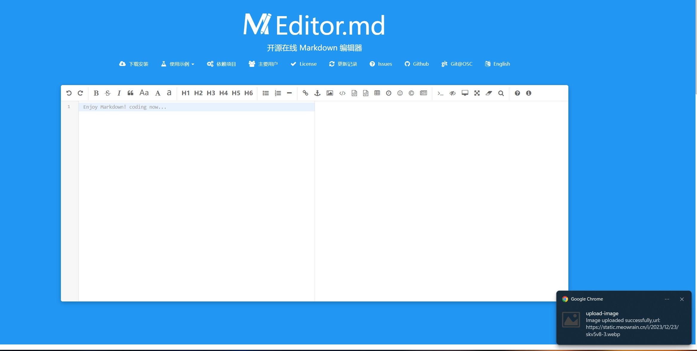

# 插件名称

Chrome图床上传工具

在在线markdown编辑器中，直接复制图片，粘贴图片就可以直接上传到你的图床，再进行粘贴就能直接显示了

## 特性

- 不再需要安装图床软件，一个浏览器插件就能搞定

## 安装

通过以下步骤手动安装插件：
   - 打开 Chrome 浏览器。
   - 在地址栏中输入 `chrome://extensions/` 并按下 Enter 键。
   - 启用「开发者模式」。
   - 点击「加载已解压的扩展程序」，选择插件文件夹并确认。

## 使用方法

填入你的API地址，POST参数名，JSON路径（返回值有一个参数，上面就是你的图片链接），还有请求体和请求头

然后打开在线编辑器
https://pandao.github.io/editor.md/

ctrl + v上传图片，再ctrl + v粘贴图片链接

## 示例

## 反馈与支持

提供获取支持或报告问题的途径。这可以是问题追踪、邮箱地址、GitHub 仓库等。

## 许可证

MIT
